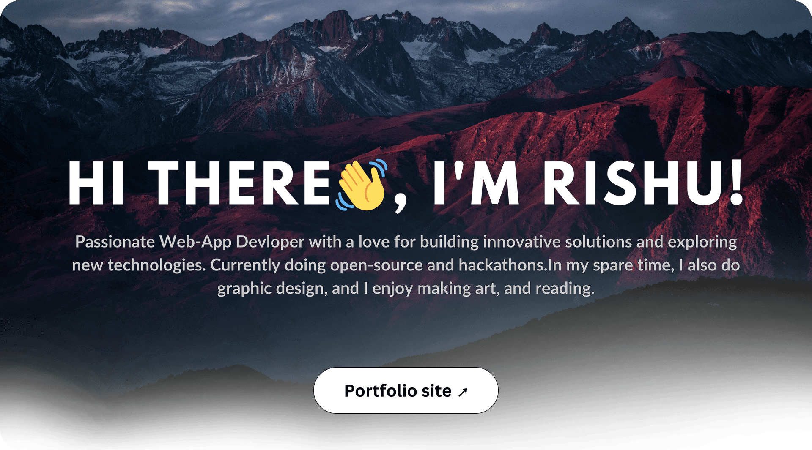

  

## My top projects

<table align="center">
  <tr>
    <!-- Card: EduHaven -->
    <td>
      <a href="https://github.com/amandollar/EduHaven">
        <svg width="350" height="300" viewBox="0 0 350 300" xmlns="http://www.w3.org/2000/svg">
          <defs>
            <!-- This clipPath rounds only the top corners (15px radius) -->
            <clipPath id="clipCardEduHaven">
              <path d="M15 0 H335 A15 15 0 0 1 350 15 V300 H0 V15 A15 15 0 0 1 15 0 Z" />
            </clipPath>
          </defs>
          <!-- Gray background with top rounded corners -->
          <rect x="0" y="0" width="350" height="300" fill="gray" clip-path="url(#clipCardEduHaven)" />
          <!-- Top stats image (header) -->
          <image
            x="0" y="0"
            width="350" height="100"
            xlink:href="https://github-readme-stats.vercel.app/api/pin/?username=amandollar&amp;repo=eduHaven&amp;bg_color=00000000&amp;hide_border=true&amp;theme=radical&amp;title_color=ffffff&amp;text_color=b8b8b8&amp;icon_color=ffffff"
            clip-path="url(#clipCardEduHaven)"
          />
          <!-- Screenshot image below -->
          <image
            x="0" y="100"
            width="350" height="200"
            xlink:href="./img/EduHaven.png"
            clip-path="url(#clipCardEduHaven)"
          />
        </svg>
      </a>
    </td>
    <!-- Card: Stay-Sphere -->
    <td>
      <a href="https://github.com/rishukumarcodes/stay-sphere">
        <svg width="350" height="300" viewBox="0 0 350 300" xmlns="http://www.w3.org/2000/svg">
          <defs>
            <clipPath id="clipCardStaySphere">
              <path d="M15 0 H335 A15 15 0 0 1 350 15 V300 H0 V15 A15 15 0 0 1 15 0 Z" />
            </clipPath>
          </defs>
          <rect x="0" y="0" width="350" height="300" fill="gray" clip-path="url(#clipCardStaySphere)" />
          <image
            x="0" y="0"
            width="350" height="100"
            xlink:href="https://github-readme-stats.vercel.app/api/pin/?username=RishuKumarCodes&amp;repo=Stay-Sphere&amp;bg_color=00000000&amp;hide_border=true&amp;theme=radical&amp;title_color=ffffff&amp;text_color=b8b8b8&amp;icon_color=ffffff"
            clip-path="url(#clipCardStaySphere)"
          />
          <image
            x="0" y="100"
            width="350" height="200"
            xlink:href="./img/Stay-sphere.png"
            clip-path="url(#clipCardStaySphere)"
          />
        </svg>
      </a>
    </td>
  </tr>
</table>

  

### Languages and Tools

 

  
  

### _Feel free to explore my repos & reach out if you'd like to collaborate!_
