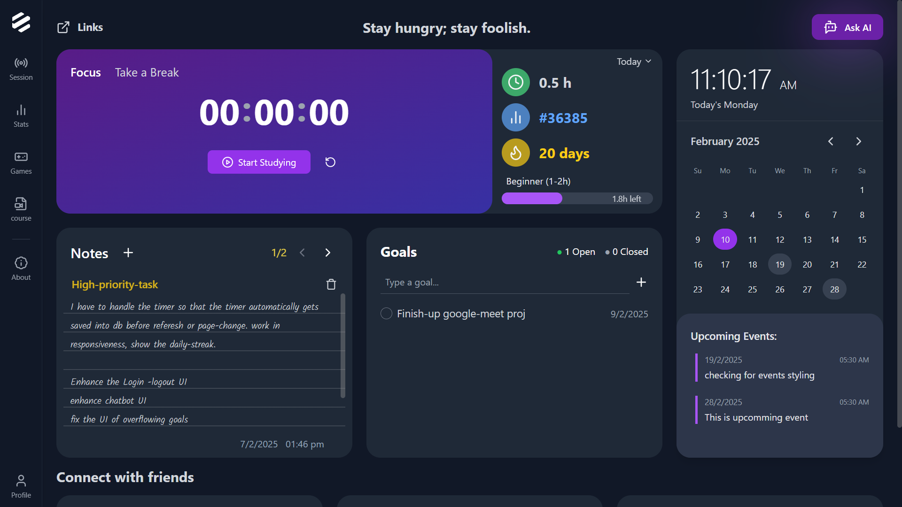
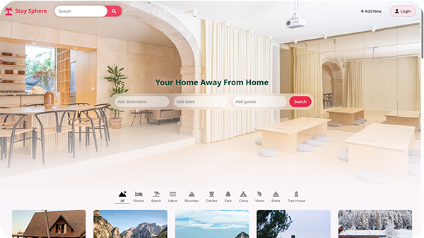

  

## Projects

<table align="center">
  <tr>
    <!-- Card: EduHaven -->
    <td>
      <a href="https://github.com/amandollar/EduHaven">
        
         
        
      </a>
       
      </a>
        
    </td>
    <!-- Card: Stay-Sphere -->
    <td>
      <a href="https://github.com/rishukumarcodes/stay-sphere">
        
         
        
         
      </a>
        
    </td>
  </tr>
</table>

  

### Tools & Tech

 

  
  

### _Feel free to explore my repos & reach out if you'd like to collaborate!_
