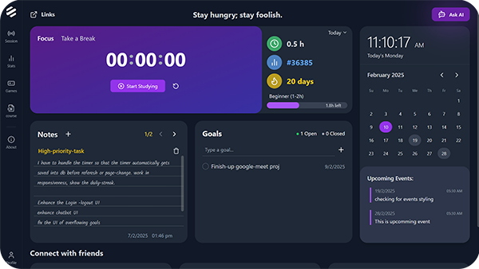

  

<!-- Top projects section -->

  My top projects

<!-- Wrap the table in a div to apply border rounding -->

  <table align="center" style="border-collapse: collapse;">
    <tr>
      <!-- Card: EduHaven -->
      <td style="min-width:300px; background-color: rgba(251,252,250,0.08); border-right: 1px solid #525252; padding:10px;">
        <a href="https://github.com/amandollar/EduHaven">
          
           
          
        </a>
      </td>
      <!-- Card: Stay-Sphere -->
      <td style="min-width:300px; background-color: rgba(251,252,250,0.08); padding:10px;">
        <a href="https://github.com/rishukumarcodes/stay-sphere">
          
           
          
        </a>
      </td>
    </tr>
  </table>

  

<!-- Languages and Tools -->

  Languages and Tools
    
  

 

<!-- Github status -->

  

    
    
  

  

### _Feel free to explore my repos & reach out if you'd like to collaborate!_
